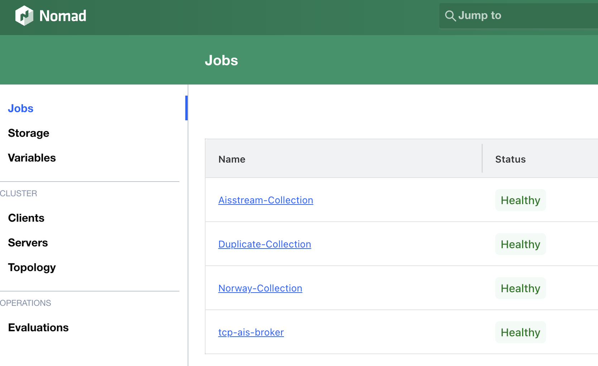

# collect



A Rust project to collect positional data into Hive-partitioned Parquet
files with Zstd compression — the bronze layer of a medallion pipeline for
maritime (AIS) data. Six binaries: four source-specific collectors and two
data parsers, run either ad hoc or unattended (Nomad, containers).

**New here?** Start with [TUTORIAL.md](TUTORIAL.md) — a four-stage
walkthrough from local storage to Apache Iceberg. This page is a map of the
docs, not a guide.

## The binaries

- **[`collect-file`](COLLECT_FILE.md)** — recursive file ingestion (plain, gzip, bzip2, zip)
- **[`collect-socket`](COLLECT_SOCKET.md)** — TCP line-stream ingestion
- **[`collect-kafka`](COLLECT_KAFKA.md)** — Kafka topic ingestion with at-least-once offset commits
- **[`collect-aisstream`](COLLECT_AISSTREAM.md)** — aisstream.io WebSocket ingestion
- **[`ais-parse`](AIS_PARSE.md)** — silver layer: decode AIS sentences into typed Parquet (positions, statics, meteo, binary, aids to navigation), via [ScottSyms/nmea-parser](https://github.com/ScottSyms/nmea-parser); local or S3 on both sides
- **[`aisstream-parse`](AISSTREAM_PARSE.md)** — silver layer: decode aisstream.io JSON from bronze Parquet into the same typed tables; local or S3 on both sides

All four collectors support optional S3/MinIO/RustFS upload, and can
register or fully decode into Apache Iceberg as they ingest — see
[TUTORIAL.md](TUTORIAL.md) stages 3 and 4.

## Documentation map

| Doc | Covers |
|---|---|
| [TUTORIAL.md](TUTORIAL.md) | Staged walkthrough: local storage → partitioning → S3 → Iceberg |
| [CLI_REFERENCE.md](CLI_REFERENCE.md) | Every flag/env var, exit codes, health signals, metrics, delivery guarantees |
| [COLLECT_FILE.md](COLLECT_FILE.md) / [COLLECT_SOCKET.md](COLLECT_SOCKET.md) / [COLLECT_KAFKA.md](COLLECT_KAFKA.md) / [COLLECT_AISSTREAM.md](COLLECT_AISSTREAM.md) | Per-collector usage and behavior |
| [AIS_PARSE.md](AIS_PARSE.md) / [AISSTREAM_PARSE.md](AISSTREAM_PARSE.md) | Decoded (silver) table schemas, incremental/idempotent decoding |
| [DOCKER_HEALTH_CHECK.md](DOCKER_HEALTH_CHECK.md) | Health-check mechanics for containers |
| [NOMAD.md](NOMAD.md) | Nomad job definitions and cluster deployment |

## Docker

```bash
docker build -t collect .
docker run -d --name data-ingest \
  -e TCP_HOST=153.44.253.27 -e TCP_PORT=5631 -e SOURCE=norway-tcp \
  -v $(pwd)/output:/data \
  collect:latest
```

The image defaults to `collect-socket`; use `--entrypoint /usr/local/bin/<binary>`
(`collect-file`, `collect-kafka`, `collect-aisstream`, `ais-parse`,
`aisstream-parse`) to run any other binary the image ships. A
docker-compose example lives in [docker-compose.yml](docker-compose.yml);
see [NOMAD.md](NOMAD.md) for cluster deployment instead.

## Building from source

```bash
curl --proto '=https' --tlsv1.2 -sSf https://sh.rustup.rs | sh
git clone <repository-url>
cd collect
cargo build --release --workspace
./target/release/collect-file --help
```

## Configuration precedence

For any flag: **command-line argument > environment variable > `--config`
file > built-in default**. See [CLI_REFERENCE.md](CLI_REFERENCE.md#shared-across-all-six-binaries)
for `--config`'s TOML format.
